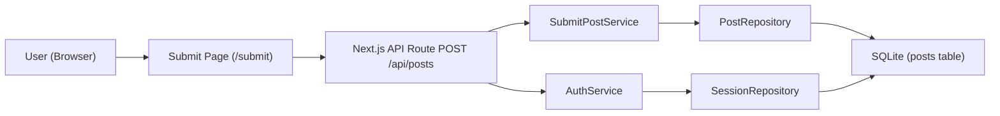
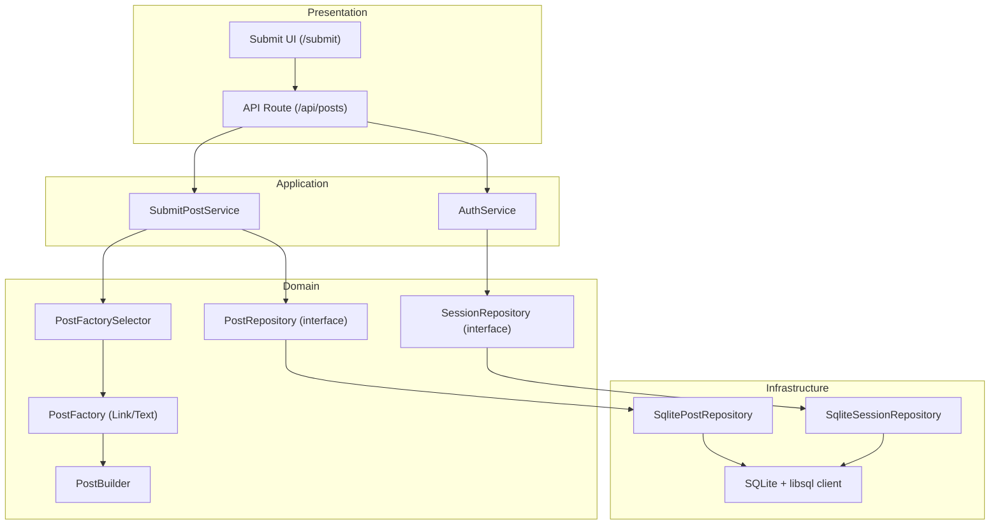
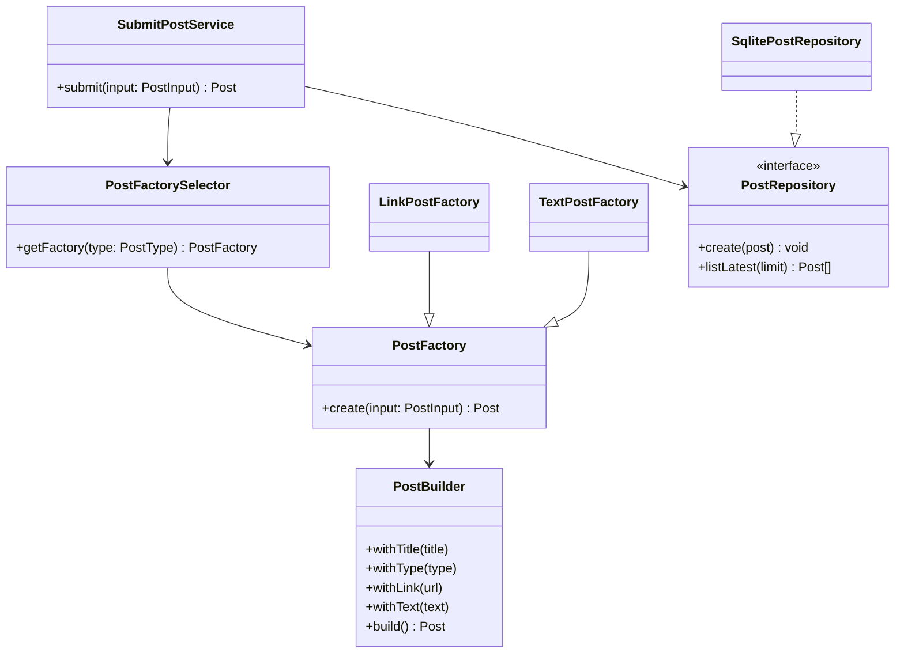
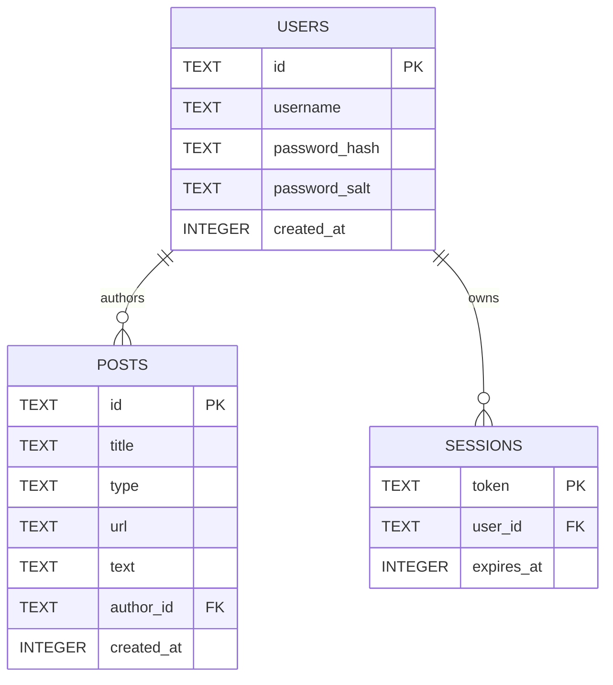
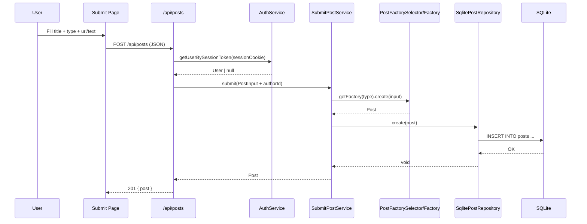

# Software Design Document - Use Case 3: Submit Post

## 1. System Overview

SlashNews is a web application where authenticated users can submit and browse
posts.\
This document focuses on **Use Case 3: Submit Post** (link or text post).

Submit Post covers:

- collecting post input from UI,
- authenticating session via cookie token,
- validating business rules,
- creating a typed post entity,
- persisting the post into SQLite,
- returning API response to the client.

## 2. System Context

- **Primary actor:** Authenticated user
- **Supporting systems:** Next.js runtime, libSQL client, SQLite database
- **Boundary of this use case:** `POST /api/posts` and supporting
  services/components

## 3. Key Features and Functionality

- Post type selection: `link` or `text`
- Auth-gated submission (session cookie is required)
- Input validation:
  - title minimum length,
  - type-specific content requirement (`url` for link, `text` for text)
- Post creation with generated `id` and `createdAt`
- Storage in `posts` table
- HTTP responses:
  - `201` success with created post payload
  - `401` when unauthenticated
  - `400` for validation/request errors

## 4. Assumptions and Dependencies

### Assumptions

- User has already logged in and has a valid `session` cookie.
- DB schema initialization is completed through infrastructure bootstrap.
- Client sends JSON payload with `title`, `type`, and conditional `url/text`.

### Dependencies

- Framework: `next` (API routes + UI)
- Runtime libraries: `react`, `react-dom`
- DB access: `@libsql/client`
- Platform: Node.js runtime (`export const runtime = "nodejs"`)

## 5. Architectural Design

### 5.1 System Architecture Diagram (High-Level)

### 5.2 Architectural Patterns and Styles

- **Layered architecture:** Presentation -> Application -> Domain ->
  Infrastructure
- **Dependency Inversion:** services depend on repository interfaces
- **Repository pattern:** abstract persistence behind domain interfaces
- **Factory Method + Builder:** controlled post variant creation
- **Singleton (lazy DB client):** one shared DB client promise per process

### 5.3 Rationale for Architectural Decisions

- Layering keeps business rules independent from framework/DB details.
- Factory + Builder reduces invalid object construction paths.
- Repository abstraction enables test stubs and future DB replacement.
- Central container wiring avoids duplicate object graph setup.

## 6. Component Design

### 6.1 Subsystems and Modules

- **UI:** `src/app/submit/page.tsx`
- **API controller:** `src/app/api/posts/route.ts`
- **Use-case service:** `src/application/services/SubmitPostService.ts`
- **Auth/session check:** `src/application/services/AuthService.ts`
- **Domain creation:** `src/domain/factories/PostFactory.ts`,
  `src/domain/builders/PostBuilder.ts`
- **Persistence ports:** `src/domain/interfaces/*.ts`
- **Persistence adapters:** `src/infrastructure/repositories/*.ts`
- **Composition root:** `src/infrastructure/container.ts`
- **DB bootstrap/client:** `src/infrastructure/db/sqlite.ts`

### 6.2 Responsibilities of Each Component

- **Submit page:** collects user input and calls API.
- **Posts API route:** request parsing, auth check, response mapping.
- **SubmitPostService:** submit workflow orchestration + input validation.
- **PostFactorySelector/Factories:** choose and build correct post variant.
- **PostBuilder:** enforce required fields and type constraints at build time.
- **SqlitePostRepository:** execute post insert/list queries.
- **AuthService + SessionRepository:** validate session token ownership/expiry.

### 6.3 Interfaces Between Components

- `POST /api/posts` (HTTP JSON)
- `SubmitPostService.submit(PostInput): Promise<Post>`
- `PostRepository.create(post): Promise<void>`
- `AuthService.getUserBySessionToken(token): Promise<User | null>`

### 6.4 Component Diagram

## 7. Data Design

### 7.1 Data Model / ER Diagram

### 7.2 Data Storage (Database or File Structure)

- Database file path: `data/app.db` (default when `SQLITE_URL` is not set)
- Storage engine: SQLite via libSQL client
- Schema creation: on DB initialization in `sqlite.ts`

### 7.3 Data Flow Diagram (Submit Post)

### 7.4 Data Validation Rules

- `title` is required and must be at least 3 characters.
- `authorId` is required.
- `type=link` requires non-empty `url`.
- `type=text` requires non-empty `text`.
- Session token must exist and map to a non-expired session.

## 8. Design Patterns

### 8.1 Applied Design Patterns

- Repository
- Dependency Injection / Composition Root
- Factory Method
- Builder
- Strategy-like factory selection
- Singleton (DB client promise)

### 8.2 Context and Justification

- **Repository:** isolates SQL from use-case logic.
- **Factory Method + Builder:** separates variant selection from safe object
  construction.
- **DI:** allows service orchestration to depend on abstractions.
- **Singleton:** prevents repeated DB client initialization and schema
  bootstrapping.

## 9. Implementation Notes

- Current submit endpoint supports create and list in the same route file
  (`POST`, `GET`).
- Error handling is currently response-oriented (`401`, `400`) without
  structured logging.
- Runtime type assertion for `PostType` is cast-based in route layer and
  protected by service/factory validation.

## 10. User Interface Design (if applicable)

### 10.1 UI Mockup / Wireframe (Textual)

- Screen title: `Submit Post`
- Fields:
  - `Title` input
  - `Type` select (`link` or `text`)
  - conditional `URL` input or `Text` textarea
- Action: `Submit` button
- Feedback area: success/error message text under form

## 11. External Interfaces

### 11.1 APIs

- `POST /api/posts`

  - request: `{ title, type, url?, text? }`
  - response success: `201 { post }`
  - response error: `401/400 { error }`

- `GET /api/posts`

  - response: `200 { posts }`

### 11.2 Third-party Systems

- `@libsql/client` for SQLite connectivity and SQL execution
- No external SaaS integration is required for Submit Post in current scope

## 12. Performance Considerations

### 12.1 Performance Requirements

- Single submit operation should complete within normal interactive latency for
  local/academic deployment.
- DB operations are simple single-row `INSERT` and indexed primary-key lookups
  for auth/session.

### 12.2 Scalability and Optimization Strategies

- Keep one DB client per process (lazy singleton).
- Use narrow SQL queries and explicit selected columns.
- Potential next optimization: add indexes for high-read access patterns
  (`created_at`, `author_id`).

## 13. Error Handling and Logging

### 13.1 Exception Management

- API route catches exceptions and maps to JSON error responses.
- Unauthorized session state is handled explicitly before use-case execution.

### 13.2 Logging Mechanisms

- Structured logging is not yet implemented in submit flow.
- Recommended future enhancement: request-scoped logs with correlation id and
  error category.

## 14. Design for Testability

- Service constructors accept abstractions (repositories/factory selector),
  enabling mocks/fakes.
- Submit flow can be unit-tested without real DB by mocking:
  - `PostRepository`
  - `PostFactorySelector` and concrete factories
- Route can be integration-tested for status code mapping and auth guard
  behavior.

## 15. Deployment and Installation Design

### 15.1 Environment Configuration

- Optional variables:
  - `SQLITE_PATH` (local DB file path)
  - `SQLITE_URL` (libSQL URL)
- Default local mode uses file DB under project `data/`.

### 15.2 Packaging and Dependencies

- Package manager: `npm`
- Build/runtime stack: Next.js + React + TypeScript + libSQL
- Standard commands:
  - `npm run dev`
  - `npm run build`
  - `npm run start`

## 16. Change Log

- **March 5, 2026:** Initial Software Design Document created for Use Case 3
  (Submit Post).

## 17. Future Work / Open Issues

- Add structured logging and observability for API/service layers.
- Add schema-level constraints/checks for stronger type-content consistency.
- Add rate limiting and anti-abuse controls for post submission.
- Improve runtime request validation with schema library (e.g., strict typed DTO
  validation).
